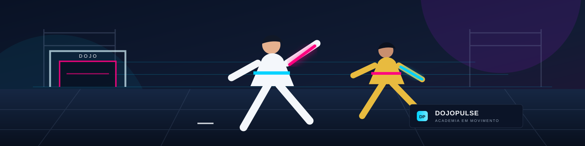
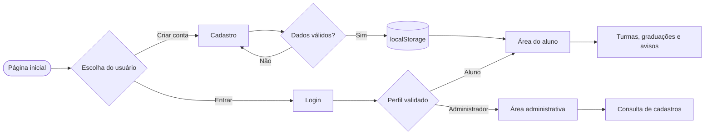

<div align="center">

# DojoPulse

### Academia em movimento

Uma plataforma web para aproximar pessoas, organizar atividades e fortalecer um projeto social de artes marciais.


[Acessar o projeto](https://kailainemiranda.github.io/DojoPulse/) · [Ver o diagrama](diagramas/diagrama-dojopulse.md)

</div>



## Navegação

- [Bem-vindo ao DojoPulse](#bem-vindo-ao-dojopulse)
- [Visão geral](#visão-geral)
- [Acesse o projeto](#acesse-o-projeto)
- [Funcionalidades](#funcionalidades)
- [Tecnologias utilizadas](#tecnologias-utilizadas)
- [Languages](#languages)
- [Como a aplicação funciona](#como-a-aplicação-funciona)
- [Estrutura do projeto](#estrutura-do-projeto)
- [Como executar localmente](#como-executar-localmente)
- [Publicação](#publicação)
- [Limitações e próximos passos](#limitações-e-próximos-passos)
- [Nossa missão](#nossa-missão)
- [Licença](#licença)

---

## Bem-vindo ao DojoPulse

---

O **DojoPulse** é um projeto web criado para organizar, conectar e fortalecer um projeto social de artes marciais. Sua missão é promover a inclusão social, a disciplina e o acesso ao esporte por meio de um espaço digital simples, moderno e acessível para alunos, professores e administradores.

Este site foi desenvolvido com foco em praticidade, usabilidade e impacto social, utilizando a tecnologia como uma aliada no desenvolvimento da comunidade e na organização do dia a dia da academia.

## Visão geral

---

O DojoPulse é uma aplicação web responsiva que centraliza informações e recursos importantes da academia:

- 🥋 **Gestão de turmas e horários:** informações organizadas sobre aulas, modalidades e professores.
- 🏅 **Consulta de graduações:** acompanhamento da evolução e das faixas dos alunos.
- 📢 **Mural de avisos:** canal direto para comunicados importantes da academia.
- 🔒 **Acesso por perfil:** ambientes distintos para alunos e administradores.

## Acesse o projeto

---

👉 [https://kailainemiranda.github.io/DojoPulse/](https://kailainemiranda.github.io/DojoPulse/)

## Funcionalidades

---

### Painel do aluno

Consulta de turmas, horários, professores, graduações e avisos da academia em uma interface centralizada.

### Painel administrativo

Área restrita para consulta dos cadastros realizados, incluindo nome, e-mail, telefone e faixa do participante.

### Interface e experiência

- Design responsivo para celulares, tablets e computadores.
- Tema escuro com identidade visual neon.
- Navegação simples e organização orientada à usabilidade.
- Separação de recursos conforme o perfil de acesso.

### Persistência local

Os dados de demonstração são armazenados no navegador por meio da API `localStorage`, sem dependência de um servidor ou banco de dados nesta versão.

### Organização do código

O projeto possui uma estrutura simples e modular, facilitando a manutenção, a leitura do código e futuras expansões.

## Tecnologias utilizadas

---

| Tecnologia | Aplicação no projeto |
| --- | --- |
| **HTML5** | Estrutura das páginas, formulários e painéis |
| **CSS3** | Layout, responsividade e identidade visual |
| **JavaScript** | Navegação, cadastro, login, validações e permissões |
| **localStorage** | Persistência local dos dados de demonstração |
| **Mermaid e SVG** | Representação visual dos fluxos e da metodologia |
| **GitHub Pages** | Hospedagem gratuita da aplicação |

As linguagens principais do projeto são **HTML, CSS e JavaScript**. O GitHub identifica automaticamente essas linguagens por meio do GitHub Linguist, considerando os arquivos versionados no repositório.

## Languages

---

- HTML
- CSS
- JavaScript

Para que essas linguagens apareçam corretamente na área **Languages** do GitHub, os arquivos `index.html`, `css/styles.css` e `javascript/app.js` precisam estar incluídos no commit enviado ao repositório. O conteúdo deste README e os badges não alteram essa identificação.

## Como a aplicação funciona

---



O diagrama completo, com os fluxos de acesso, a estrutura tecnológica e o cadastro de dados, está disponível em [diagramas/diagrama-dojopulse.md](diagramas/diagrama-dojopulse.md). Também é possível consultar o [fluxograma visual em SVG](diagramas/metodologia-dojopulse.svg).

## Estrutura do projeto

---

```text
DojoPulse/
├── index.html                    # Interface, cadastro, login e painéis
├── css/
│   └── styles.css                # Estilos e responsividade
├── javascript/
│   └── app.js                    # Regras de navegação e autenticação local
├── diagramas/
│   ├── diagrama-dojopulse.md     # Diagramas em Mermaid
│   └── metodologia-dojopulse.svg # Fluxograma visual
├── imagens/
│   └── dojopulse-form-banner.svg # Imagem de apresentação
└── LICENSE                       # Licença do projeto
```

## Como executar localmente

---

1. Clone este repositório ou faça o download dos arquivos.
2. Abra a pasta no VS Code.
3. Abra o arquivo `index.html` no navegador.

Para uma melhor experiência durante o desenvolvimento, utilize a extensão **Live Server** do VS Code e abra o projeto com **Open with Live Server**.

Não é necessário instalar Node.js ou executar `npm install`: esta versão é uma aplicação estática feita com HTML, CSS e JavaScript.

## Publicação

---

O projeto pode ser publicado gratuitamente pelo GitHub Pages:

1. Acesse **Settings > Pages** no repositório.
2. Em **Build and deployment**, selecione **Deploy from a branch**.
3. Escolha a branch `main` e a pasta `/ (root)`.
4. Clique em **Save** e aguarde a publicação.

## Limitações e próximos passos

---

Atualmente, o DojoPulse é um protótipo estático e armazena os dados apenas no navegador. Para uma versão de produção, os próximos passos seriam:

- Criar uma API e integrar um banco de dados.
- Implementar autenticação segura no servidor.
- Armazenar senhas com hash e aplicar controle de permissões no backend.
- Adicionar recuperação de senha, backups e gerenciamento real de usuários.

## Nossa missão

---

O DojoPulse acredita no poder transformador do esporte e da educação. O projeto foi pensado para:

- **Promover a inclusão social:** facilitar a entrada e a permanência de jovens e adultos nas artes marciais.
- **Descomplicar a gestão:** oferecer ferramentas acessíveis para que projetos sociais organizem suas atividades sem custos de infraestrutura.
- **Valorizar cada aluno:** acompanhar a evolução dos participantes e fortalecer o sentimento de pertencimento à comunidade.

O objetivo é contribuir para a transformação de vidas dentro e fora do tatame, aproximando tecnologia, esporte e desenvolvimento social.

## Licença

---

Este projeto está disponível sob a licença [MIT](LICENSE).

<div align="center">

Desenvolvido com HTML, CSS e JavaScript para apoiar a evolução dentro e fora do tatame.

</div>
