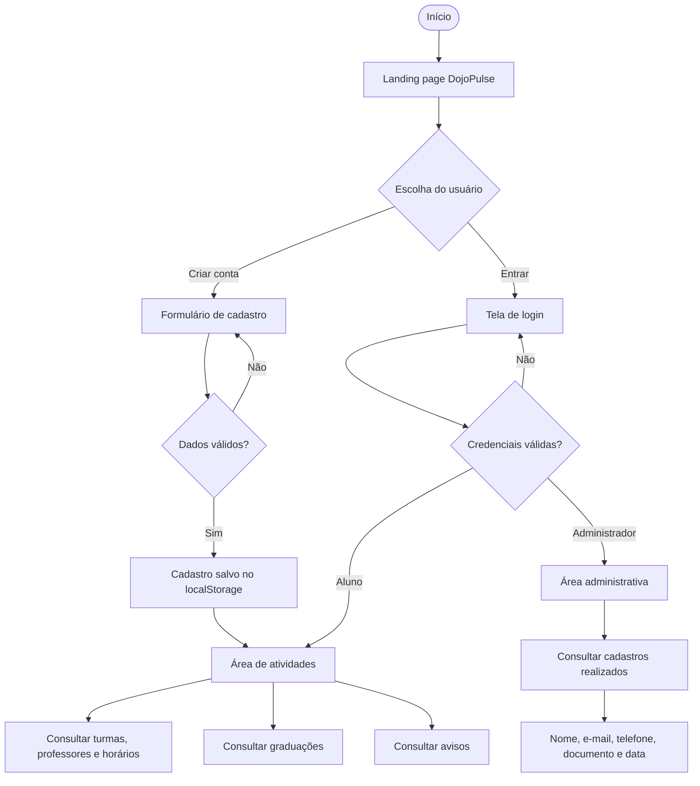
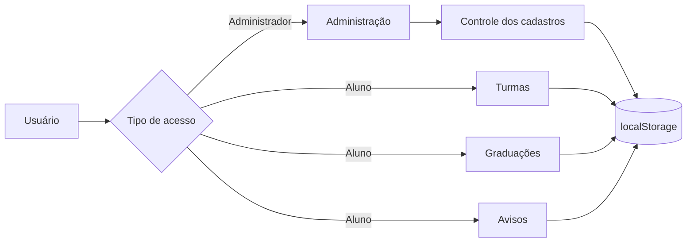
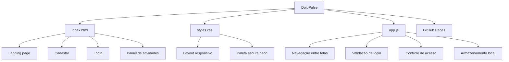
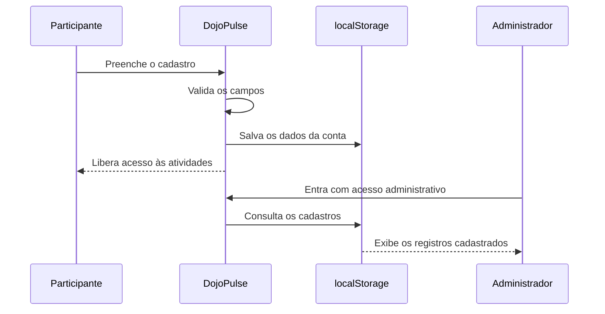

## Fluxo principal da aplicação

```mermaid
flowchart TD
    A([Início]) --> B[Landing page DojoPulse]
    B --> C{Escolha do usuário}
    C -->|Criar conta| D[Formulário de cadastro]
    C -->|Entrar| E[Tela de login]
    D --> F{Dados válidos?}
    F -->|Não| D
    F -->|Sim| G[Cadastro salvo no localStorage]
    G --> H[Área de atividades]
    E --> I{Credenciais válidas?}
    I -->|Não| E
    I -->|Aluno| H[Área de atividades]
    I -->|Administrador| J[Área administrativa]
    H --> K[Consultar turmas, professores e horários]
    H --> L[Consultar graduações]
    H --> M[Consultar avisos]
    J --> N[Consultar cadastros realizados]
    N --> O[Nome, e-mail, telefone, documento e data]
```

## Fluxo de acesso por perfil

```mermaid
flowchart LR
    A[Usuário] --> B{Tipo de acesso}
    B -->|Aluno| C[Turmas]
    B -->|Aluno| D[Graduações]
    B -->|Aluno| E[Avisos]
    B -->|Administrador| F[Administração]
    F --> G[Controle dos cadastros]
    G --> H[(localStorage)]
    C --> H
    D --> H
    E --> H
```

## Estrutura tecnológica

```mermaid
graph TD
    A[DojoPulse] --> B[index.html]
    A --> C[styles.css]
    A --> D[app.js]
    A --> E[GitHub Pages]
    B --> F[Landing page]
    B --> G[Cadastro]
    B --> H[Login]
    B --> I[Painel de atividades]
    C --> J[Layout responsivo]
    C --> K[Paleta escura neon]
    D --> L[Navegação entre telas]
    D --> M[Validação de login]
    D --> N[Controle de acesso]
    D --> O[Armazenamento local]
```

## Cadastro de dados

```mermaid
sequenceDiagram
    participant P as Participante
    participant S as DojoPulse
    participant B as localStorage
    participant A as Administrador

    P->>S: Preenche o cadastro
    S->>S: Valida os campos
    S->>B: Salva os dados da conta
    S-->>P: Libera acesso às atividades
    A->>S: Entra com acesso administrativo
    S->>B: Consulta os cadastros
    B-->>A: Exibe os registros cadastrados
```

